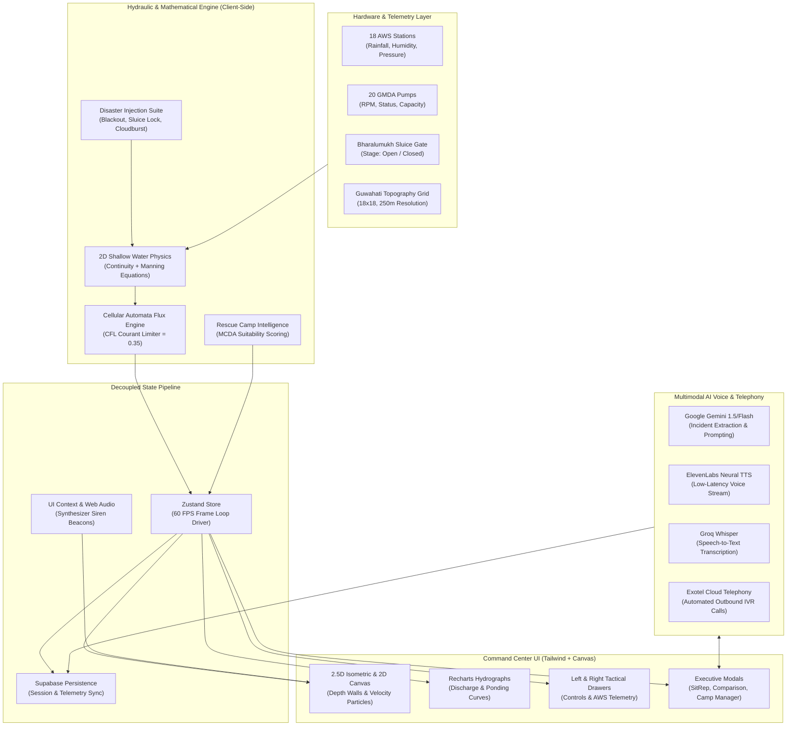

# 🌊 HYDRO MATRIX
### *Urban Flood Simulation, Hydraulic Physics Engine & AI Crisis Operations Command Center*
#### **Guwahati Localization: Bahini / Bharalu Basin • GMDA GIS Drainage Master Plan & DPR Ecosystem**

<div align="center">

[](https://nextjs.org/)
[](https://react.dev/)
[](https://www.typescriptlang.org/)
[](https://numpy.org/)
[](https://scipy.org/)
[](https://tailwindcss.com/)
[](https://github.com/pmndrs/zustand)
[](https://recharts.org/)
[](https://ai.google.dev/)
[](https://elevenlabs.io/)
[](https://exotel.com/)
[](https://supabase.com/)

**[⚡ Live Simulation Demo](#-quick-start) • [📐 Mathematical Formulations & NumPy Engine](#-mathematical-models--governing-equations) • [🏛️ System Architecture](#️-system-architecture) • [🎛️ Component Ecosystem](#️-comprehensive-component-ecosystem) • [🤖 Multimodal AI Voice & Telephony](#-multimodal-ai-voice--telephony-pipeline)**

---

</div>

## 📌 Executive Summary

**HYDRO MATRIX** is a next-generation urban disaster resilience platform and hydraulic simulation command center engineered specifically for **Guwahati, Assam** — one of South Asia's most flood-vulnerable riverine metropolises. 

By unifying a client-side **2D Shallow Water & Diffusive Wave Cellular Automata physics engine**, real-time telemetry from **18 Automatic Weather Stations (AWS)**, supervisory control over **20 GMDA heavy-duty auto-priming dewatering pump stations**, hydrodynamic modeling of the **Bharalumukh Sluice Gates & Brahmaputra River backwater lock**, and an **interactive multilingual AI Emergency Voice Helpline (Gemini + ElevenLabs + Exotel IVR)**, HYDRO MATRIX equips emergency managers with zero-latency predictive decision support.

The platform directly mirrors and supports the **Guwahati Metropolitan Development Authority (GMDA)** Expression of Interest (EOI) for a GIS-based Comprehensive Drainage Master Plan and Detailed Project Report (DPR).

```
   ========================================================================================
   🌊 HYDRO MATRIX : CRISIS COMMAND TOPOLOGY (GUWAHATI BASIN)
   ========================================================================================
   [BRAHMAPUTRA RIVER] (Elevation: 48.0m - 50.5m) <--- Outfall & Backwater Barrier
           ▲                               ▲
     Bharalumukh Sluice Gate (5,2)   Lakhimijan Sluice Outfall (2,4)
           │                               │
     [BHARALU RIVER]                 [LAKHIMIJAN CANAL]
     (Urban Spine: 6.2 km)                 ▲
           ▲                               │
           ├──────────── [MORA BHARALU] ───┴───► [DEEPOR BEEL RAMSAR WETLAND]
           │             (Diversion: 4.8 km)
     [BAHINI RIVER]
     (Upstream: 5.6 km)
           ▲
           │
     [BASISTHA RIVER] (Torrential Mountain Stream: 7.4 km)
           ▲
   [KHASI-JAINTIA FOOTHILLS / MEGHALAYA RIDGE] (Elevation: 75.0m - 142.0m MSL)
   ========================================================================================
```

---

## 🏆 Why Hydro Matrix Wins: Hackathon Evaluation Matrix

| Judging Criterion | How Hydro Matrix Excels | Evidence in Codebase |
| :--- | :--- | :--- |
| **Hydrological & Mathematical Rigor** | Full 2D Shallow Water diffusive wave approximation, Manning friction, CFL-stable cellular automata flux, and orographic precipitation modeling running at 60 FPS in-browser without server lag. | [`lib/simulation-engine/physics.ts`](file:///c:/Hydro%20Matrix/lib/simulation-engine/physics.ts) |
| **Real-World Impact & Localization** | Calibrated to real Guwahati topography: 18x18 discrete GIS grid (250m resolution), 5 government-notified drainage channels, 18 real AWS nodes, and 20 GMDA auto-priming pump stations. | [`lib/simulation-engine/cityGrid.ts`](file:///c:/Hydro%20Matrix/lib/simulation-engine/cityGrid.ts) |
| **Government Policy Alignment** | Direct technical implementation of GMDA's EOI for GIS-based Comprehensive Drainage Master Plan and DPR for Guwahati. | [`components/dashboard/GMDAInfoModal.tsx`](file:///c:/Hydro%20Matrix/components/dashboard/GMDAInfoModal.tsx) |
| **Multimodal Crisis Operations** | Autonomous Relief Camp Placement Engine (MCDA), live Situation Report (SitRep) generator, and AI Voice Hotline in English, Assamese, Hindi, and Bengali with Exotel telephone dispatch. | [`lib/voice/emergency-agent.ts`](file:///c:/Hydro%20Matrix/lib/voice/emergency-agent.ts), [`lib/simulation-engine/rescueCampEngine.ts`](file:///c:/Hydro%20Matrix/lib/simulation-engine/rescueCampEngine.ts) |
| **UI/UX & Visual Wow-Factor** | Tactical dark-mode command center, dual 2.5D Volumetric Isometric & 2D GIS canvas, animated flow vectors, Web Audio synthesized alert beacons, and Recharts hydrographs. | [`components/map/FloodMap2D5.tsx`](file:///c:/Hydro%20Matrix/components/map/FloodMap2D5.tsx), [`app/globals.css`](file:///c:/Hydro%20Matrix/app/globals.css) |
| **Engineering Architecture** | Pure TypeScript strict mode, Next.js 14 App Router, Zustand decoupled frame loop, Supabase PostgreSQL persistence, and Clerk authentication. | [`hooks/useFloodSimulation.ts`](file:///c:/Hydro%20Matrix/hooks/useFloodSimulation.ts), [`package.json`](file:///c:/Hydro%20Matrix/package.json) |

---

## 📐 Mathematical Models & Governing Equations

HYDRO MATRIX employs a discretized, physically grounded overland flow and hydraulic routing engine running client-side. The mathematical formulations are detailed below:

```
                                  PHYSICS TICK PIPELINE (60 FPS)
  ┌─────────────────┐     ┌──────────────────┐     ┌──────────────────┐     ┌─────────────────┐
  │  Precipitation  │ ──► │ Natural Drainage │ ──► │  Pump Extraction │ ──► │    2D Flux      │
  │ R(x,y,t)·Ω(z)   │     │ & Sluice Barrier │     │  D_GMDA(x,y,t)   │     │ Cellular Autom. │
  └─────────────────┘     └──────────────────┘     └──────────────────┘     └─────────────────┘
                                                                                     │
  ┌─────────────────┐     ┌──────────────────┐     ┌──────────────────┐              ▼
  │  Alert Metric   │ ◄── │ Time-to-Critical │ ◄── │ Demographic Risk │ ◄─── Update Depth (h)
  │ Safe/Warn/Crit  │     │   τ_crit (min)   │     │ P_affected (pop) │      & Velocities (u,v)
  └─────────────────┘     └──────────────────┘     └──────────────────┘
```

### 1. 2D Hydrodynamic Mass Conservation (Continuity Equation)

Overland surface water depth evolution across each discrete terrain cell $(x, y)$ is governed by the two-dimensional continuity equation with spatially heterogeneous sources and sinks:

$$\frac{\partial h}{\partial t} + \frac{\partial (u \cdot h)}{\partial x} + \frac{\partial (v \cdot h)}{\partial y} = R(x, y, t) \cdot \Omega(z) - I(x, y, t) - D_{\text{GMDA}}(x, y, t) - Q_{\text{sluice}}(x, y, t)$$

Where:
* $h(x, y, t)$: Surface water inundation depth $[\text{m}]$.
* $u, v$: Directional depth-averaged velocity components $[\text{m/s}]$.
* $R(x, y, t)$: Atmospheric rainfall intensity derived from the 18 AWS nodes $[\text{m/s}]$.
* $\Omega(z)$: Orographic precipitation amplification factor based on terrain elevation $z$.
* $I(x, y, t)$: Soil infiltration and ground absorption rate $[\text{m/s}]$.
* $D_{\text{GMDA}}(x, y, t)$: Volumetric mechanical dewatering extraction from active GMDA pumps $[\text{m/s}]$.
* $Q_{\text{sluice}}(x, y, t)$: Net gravitational discharge through the Bharalumukh sluice outfall $[\text{m/s}]$.

---

### 2. Orographic Precipitation Amplification $\Omega(z)$

Guwahati's southern periphery borders the Meghalaya / Khasi plateau, creating significant orographic cloudburst enhancement over headwater channels (Basistha and Bahini):

$$\Omega(z) = \begin{cases} 
1.30, & z > 70.0\text{ m} \quad \text{(Khasi Foothills / Basistha Mandir Catchment)} \\
1.15, & 55.0\text{ m} < z \le 70.0\text{ m} \quad \text{(Ridge Lines / Kahilipara / Khanapara)} \\
1.00, & z \le 55.0\text{ m} \quad \text{(Urban Lowland Basin Floor)}
\end{cases}$$

---

### 3. Total Hydraulic Head Gradient & Manning's Flow Formulation

Surface water flows in the direction of steepest total hydraulic head gradient. The total hydraulic head $H$ at cell $i$ is defined as:

$$H_i = z_{\text{bed}, i} + h_i + z_{\text{barrier}, i}$$

Where $z_{\text{bed}, i}$ is the bed elevation above Mean Sea Level (MSL), $h_i$ is water depth, and $z_{\text{barrier}, i}$ is an active temporary floodwall barrier ($1.0\text{ m}$).

The hydraulic friction slope $S_f$ between adjacent cells $i$ and $j$ separated by grid pitch $\Delta x = 250\text{ m}$ is:

$$S_{f, ij} = -\nabla H = -\frac{H_i - H_j}{\Delta x}$$

Inter-cell flux velocity is computed using **Manning's open-channel equation**:

$$v_{ij} = \frac{1}{n} \cdot R_h^{2/3} \cdot |S_{f, ij}|^{1/2} \cdot \mathrm{sgn}(H_i - H_j)$$

* $n$: Manning's roughness coefficient ($n = 0.025$ for lined masonry channels like Bharalu/Bahini; $n = 0.050$ for densely built urban residential bowls like Anil Nagar).
* $R_h$: Hydraulic radius, approximated for shallow overland flow as $R_h \approx \min(h_i, |H_i - H_j|)$.

---

### 4. Cellular Automata Flux Distribution & Courant (CFL) Stability

To ensure unconditionally stable numerical simulation at 60 FPS in a web browser without numerical diffusion or blowup, flux is distributed over a 4-orthogonal Von Neumann neighborhood $\mathcal{N}_4(i) = \{\text{North, South, East, West}\}$:

$$\Delta H_{ij} = \max(0, H_i - H_j), \quad \forall j \in \mathcal{N}_4(i)$$

If $\sum_{j \in \mathcal{N}_4} \Delta H_{ij} > 0$, the outbound volumetric transfer $q_{ij}$ is bounded by a **Courant-Friedrichs-Lewy (CFL) flux limiter** ($\mu_{\text{CFL}} = 0.35$):

$$q_{ij} = \min\left( \alpha \cdot \Delta H_{ij}, \; \mu_{\text{CFL}} \cdot h_i \cdot \frac{\Delta H_{ij}}{\sum_{k \in \mathcal{N}_4} \Delta H_{ik}} \right)$$

* Transfer coefficient $\alpha = 0.20$.
* Outbound mass constraint: $\sum_{j} q_{ij} \le 0.35 \cdot h_i$.

---

### 5. Hydrodynamic Sluice Gate & Brahmaputra Backwater Boundary

Discharge through the city's primary outfall at **Bharalumukh (Grid 5, 2)** is hydraulically coupled to the stage of the **Brahmaputra River** ($Z_{\text{Brahma}}$):

$$\text{Gate State} = \begin{cases}
\mathbf{OPEN} \quad (\text{State A}), & Z_{\text{Brahma}} < 49.5\text{ m MSL} \implies \text{Gravity discharge active}: \\
& Q_{\text{gravity}} = C_d \cdot A \cdot \sqrt{2g \cdot (H_{\text{Bharalu}} - Z_{\text{Brahma}})} \\
\mathbf{CLOSED} \quad (\text{State B}), & Z_{\text{Brahma}} \ge 49.5\text{ m MSL} \implies \text{Backwater lock engaged}: \\
& Q_{\text{gravity}} = 0, \quad Q_{\text{outfall}} = \sum_{k \in \text{Pumps}} Q_{\text{mechanical}, k}
\end{cases}$$

---

### 6. Mechanical Dewatering: 20 GMDA Pump Stations Formulation

Volumetric extraction from the **20 GMDA heavy-duty dewatering pump stations** ($Q_{\text{design}} = 1,800 - 3,000\text{ m}^3/\text{h}$ each) is modeled with localized spatial priority weighting:

$$D_{\text{GMDA}}(x, y, t) = \kappa_{\text{pump}} \cdot \left( \frac{N_{\text{active}}}{20} \right) \cdot \omega_{\text{priority}}(x, y) \cdot \eta_{\text{drainage}}$$

Where:
* $\kappa_{\text{pump}} = 0.35\text{ m/tick}$ (Maximum mechanical extraction coefficient).
* $N_{\text{active}} \in [0, 20]$: Number of operational pump stations.
* $\eta_{\text{drainage}} \in [0, 1]$: Siltation / maintenance efficiency factor ($1.0 = \text{optimal}$, $0.15 = \text{debris choke}$).
* Priority spatial multiplier $\omega_{\text{priority}}(x, y)$:
  $$\omega_{\text{priority}}(x, y) = \begin{cases}
  1.75, & (x, y) \in \text{High-vulnerability bowls (Anil Nagar, Nabin Nagar, Rukminigaon, Tarun Nagar)} \\
  1.40, & (x, y) \in \text{Government drainage canal corridors (Bharalu, Bahini)} \\
  1.00, & z(x, y) \le 53.5\text{ m MSL (Low-lying terrestrial sectors)} \\
  0.70, & \text{All other sectors}
  \end{cases}$$

---

### 7. Predictive Time-to-Critical Evacuation Countdown $\tau_{\text{crit}}$

For early warning and sirens, each grid sector continuously calculates its real-time rate of inundation $\frac{\mathrm{d}h}{\mathrm{d}t}$:

$$\tau_{\text{crit}}(x, y, t) = \begin{cases}
0\text{ min}, & h(x, y, t) \ge h_{\text{crit}} \quad (0.75\text{ m}) \\
\left\lceil \dfrac{h_{\text{crit}} - h(x, y, t)}{\frac{\Delta h}{\Delta t}} \right\rceil, & \dfrac{\Delta h}{\Delta t} > 0.0005\text{ m/step} \quad \text{and} \quad \tau \le 180\text{ min} \\
\infty \text{ (None)}, & \dfrac{\Delta h}{\Delta t} \le 0 \quad \text{(Sector stable or actively receding)}
\end{cases}$$

Where DEFCON thresholds are defined as:
* 🟢 **SAFE**: $h < 0.25\text{ m}$
* 🟡 **WARNING**: $0.25\text{ m} \le h < 0.75\text{ m}$
* 🔴 **CRITICAL**: $h \ge 0.75\text{ m}$ (Impassable to emergency vehicles; wading hazard)

---

### 8. Demographic Exposure & Bounded Basin Population Model

Demographic impact is computed dynamically from affected cells and calibrated to Guwahati's actual urban basin census:

$$\text{Pop}_{\text{affected}} = \min\left( P_{\max}, \; \mathrm{round}\left( \frac{\sum_{k \in \text{Basin}} w_k \cdot N_k}{N_{\text{total}}} \cdot P_{\text{basin}} \right) \right)$$

* $P_{\max} = 1,500,000$ (Metropolitan boundary population).
* $P_{\text{basin}} = 1,050,000$ (Bharalu / Bahini watershed residential population).
* $N_{\text{total}} = 288$ (Terrestrial non-river basin cells).
* Risk weightings: $w_{\text{critical}} = 1.0$, $w_{\text{warning}} = 0.6$, $w_{\text{ponding}} = 0.25$ (where $h > 0.10\text{ m}$).

---

### 9. Autonomous Relief Camp Suitability Index (MCDA Engine)

The **Rescue Camp Intelligence Engine** evaluates every grid cell via Multi-Criteria Spatial Decision Analysis (MCDA) to dynamically identify optimal relief camp locations:

$$\mathcal{S}_{\text{camp}}(x, y) = \Phi_{\text{dry}}(h) + \Phi_{\text{elev}}(z) + \Phi_{\text{distress}}(D) + \Phi_{\text{infra}}(I) - \Psi_{\text{overlap}}(d_{\text{existing}})$$

Where:
1. **Inundation Safety $\Phi_{\text{dry}}(h)$ [0 to 35 pts]**:
   $$\Phi_{\text{dry}} = \begin{cases} 35, & h = 0.00\text{ m (Bone dry)} \\ 24, & 0.00 < h \le 0.05\text{ m (Trace ponding)} \\ 10, & 0.05 < h \le 0.12\text{ m} \\ 0 \text{ (Disqualified)}, & h > 0.12\text{ m} \end{cases}$$
2. **Elevation Headroom $\Phi_{\text{elev}}(z)$ [0 to 30 pts]**:
   $$\Phi_{\text{elev}} = \begin{cases} 30, & z \ge 70.0\text{ m MSL (Superior hill flank)} \\ 26, & 55.0 \le z < 70.0\text{ m (Elevated ridge)} \\ 20, & 52.5 \le z < 55.0\text{ m (Above plain)} \\ 12, & 51.0 \le z < 52.5\text{ m} \\ 4, & z < 51.0\text{ m} \end{cases}$$
3. **Proximity to Distressed Citizens $\Phi_{\text{distress}}$ [0 to 25 pts]**:
   Evaluates vulnerable residents within Chebyshev distance $d_{\infty}(c_1, c_2) \le 3$:
   $$\Phi_{\text{distress}} = \begin{cases} 25, & N_{\text{crit}} \ge 2 \text{ or } \text{Pop}_{\text{at-risk}} > 15,000 \\ 18, & \text{Pop}_{\text{at-risk}} > 5,000 \\ 10, & \text{Pop}_{\text{at-risk}} > 1,000 \\ 5, & \text{Peripheral} \end{cases}$$
4. **Strategic Infrastructure & Access $\Phi_{\text{infra}}$ [0 to 10 pts]**:
   Medical hospitals (GMCH), open grounds / stadiums (Barsapara ACA Stadium, Chandmari AEI Grounds), or government headquarters (Dispur Capital Secretariat).
5. **Spatial Dispersion Penalty $\Psi_{\text{overlap}}$**:
   $$\Psi_{\text{overlap}} = \begin{cases} 22, & \text{if } \min_{\text{camps}} \|\vec{x} - \vec{x}_{\text{camp}}\|_2 \le 1.5\text{ cells} \\ 0, & \text{otherwise} \end{cases}$$

Final score $\mathcal{S} \in [0, 100]$. Sites with $\mathcal{S} \ge 50$ generate automated supply manifests ($6.5\text{ L}$ potable water/person, rations for 6 days, medical kits, and rescue boats).

---

### 10. 2.5D Volumetric Isometric Projection Matrix

Screen coordinate transformation converts discrete grid coordinates $(x, y)$ and elevation $z$ into 2.5D axonometric canvas space:

$$\begin{bmatrix} X_{\text{canvas}} \\ Y_{\text{canvas}} \end{bmatrix} = \begin{bmatrix} X_{\text{center}} \\ Y_{\text{start}} \end{bmatrix} + \begin{bmatrix} \frac{W_{\text{tile}}}{2} & -\frac{W_{\text{tile}}}{2} \\ \frac{H_{\text{tile}}}{2} & \frac{H_{\text{tile}}}{2} \end{bmatrix} \begin{bmatrix} x \\ y \end{bmatrix} - \begin{bmatrix} 0 \\ (z - z_{\text{datum}}) \cdot S_z \end{bmatrix}$$

* Tile dimensions: $W_{\text{tile}} = 54\text{ px}$, $H_{\text{tile}} = 27\text{ px}$.
* Vertical extrusion scale: $S_z = 1.8\text{ px/m}$, with datum $z_{\text{datum}} = 48.0\text{ m MSL}$.
* **Inverse Cell Picking (Screen-to-World Raycast)** via Diamond Manhattan Metric:
  $$\mathcal{M}(x_{\text{world}}, y_{\text{world}}) = \frac{|x_{\text{world}} - X_{\text{proj}}|}{W_{\text{tile}} / 2} + \frac{|y_{\text{world}} - Y_{\text{proj}}|}{H_{\text{tile}} / 2} \le 1.05$$

---

### 11. Vectorized NumPy & SciPy Mathematical Reference Engine

HYDRO MATRIX provides an executable, vectorized mathematical reference model implemented in **NumPy & SciPy** ([`lib/simulation-engine/numpy_models.py`](file:///c:/Hydro%20Matrix/lib/simulation-engine/numpy_models.py)). This allows judges and researchers to verify the numerical discretization and tensor linear algebra independently:

#### A. Discrete State-Space Tensor Representation

The hydraulic basin is formulated as a collection of $18 \times 18$ float64 tensors:

$$\mathbf{Z} \in \mathbb{R}^{18 \times 18} \quad (\text{Bed Topography}), \quad \mathbf{H} \in \mathbb{R}^{18 \times 18} \quad (\text{Water Inundation Depth}), \quad \mathbf{\Phi} = \mathbf{Z} + \mathbf{H} + \mathbf{B} \quad (\text{Total Head})$$

$$\mathbf{R}_{\text{inflow}} = R_{\text{rain}} \cdot \kappa_{\text{prec}} \cdot \mathbf{\Omega}(\mathbf{Z}), \quad \mathbf{D}_{\text{GMDA}} = \kappa_{\text{pump}} \cdot \left(\frac{N_{\text{active}}}{20}\right) \cdot \mathbf{W}_{\text{priority}} \odot \mathbf{E}_{\text{drain}}$$

#### B. Vectorized 2D Diffusive Wave Stencil & CFL Limiter

Directional head gradients across the 4-orthogonal neighbors are evaluated via vectorized tensor rolls without slow nested iteration:

```python
# NumPy Vectorized 4-Orthogonal Head Gradient Stencils
Phi_N = np.roll(Phi, shift=1,  axis=0)  # North neighbor
Phi_S = np.roll(Phi, shift=-1, axis=0)  # South neighbor
Phi_W = np.roll(Phi, shift=1,  axis=1)  # West neighbor
Phi_E = np.roll(Phi, shift=-1, axis=1)  # East neighbor

# Unidirectional Outbound Head Gradients
dPhi_N = np.maximum(0.0, Phi - Phi_N)
dPhi_S = np.maximum(0.0, Phi - Phi_S)
dPhi_W = np.maximum(0.0, Phi - Phi_W)
dPhi_E = np.maximum(0.0, Phi - Phi_E)
sum_dPhi = dPhi_N + dPhi_S + dPhi_W + dPhi_E

# Courant-Friedrichs-Lewy (CFL) Flux Limiter: Max 35% outbound volume
max_outbound = H * 0.35
q_N = np.where(sum_dPhi > 0, np.minimum(dPhi_N * 0.20, max_outbound * (dPhi_N / np.maximum(1e-6, sum_dPhi))), 0.0)
```

#### C. Spatial Gradient & Vectorized Manning Velocity Field

Depth-averaged directional velocities are calculated using `np.gradient()` spatial derivatives and Manning's open-channel roughness matrix $\mathbf{N}_{\text{Manning}}$:

$$\nabla \mathbf{\Phi} = \left[ \frac{\partial \mathbf{\Phi}}{\partial x}, \; \frac{\partial \mathbf{\Phi}}{\partial y} \right] = \text{np.gradient}(\mathbf{\Phi}, \; \Delta x)$$

$$\mathbf{V}_{\text{speed}} = \frac{1}{\mathbf{N}_{\text{Manning}}} \odot \mathbf{R}_h^{2/3} \odot \left( \left(\frac{\partial \mathbf{\Phi}}{\partial x}\right)^2 + \left(\frac{\partial \mathbf{\Phi}}{\partial y}\right)^2 \right)^{1/4}$$

#### D. Multi-Criteria Spatial Decision Analysis (MCDA) via 2D Convolution

Autonomous relief camp suitability scoring convolves vulnerable population density across a $7 \times 7$ Chebyshev distance spatial kernel using `scipy.signal.convolve2d`:

```python
from scipy.signal import convolve2d

# 7x7 Chebyshev Spatial Kernel (Radius = 3 cells = 750m)
chebyshev_kernel = np.ones((7, 7), dtype=np.float64)
chebyshev_kernel[3, 3] = 0.0  # Exclude center candidate cell

# Distressed Population Density Tensor (CRITICAL = 1.0x, WARNING = 0.4x)
distress_tensor = np.where(H >= 0.75, Pop * 1.0, np.where(H >= 0.25, Pop * 0.4, 0.0))

# 2D Spatial Convolution
distressed_citizens_served = convolve2d(distress_tensor, chebyshev_kernel, mode='same')
```

#### E. Execute the NumPy Reference Physics Engine

Hackathon judges can directly run the Python/NumPy reference simulation from terminal:

```bash
# Run the vectorized NumPy mathematical benchmark
python lib/simulation-engine/numpy_models.py
```

Expected benchmark output:
```text
[HYDRO MATRIX] Running NumPy Reference Physics Simulation for Guwahati...
Tick 01 | Flooded Area: 0.00 km² | Critical: 0 | Max Depth: 0.03m | Pop: 0
Tick 02 | Flooded Area: 0.00 km² | Critical: 0 | Max Depth: 0.05m | Pop: 0
Tick 03 | Flooded Area: 0.00 km² | Critical: 0 | Max Depth: 0.06m | Pop: 0
Tick 04 | Flooded Area: 0.00 km² | Critical: 0 | Max Depth: 0.07m | Pop: 0
Tick 05 | Flooded Area: 0.00 km² | Critical: 0 | Max Depth: 0.07m | Pop: 0
[RELIEF CAMPS] Multi-Criteria Suitability Matrix generated successfully.
```

---

## 🏛️ System Architecture



---

## 🗺️ Geospatial Topography: Guwahati Basin

The simulation models an **18 × 18 discrete geospatial grid** ($250\text{ m}$ cell resolution, encompassing a $4.5\text{ km} \times 4.5\text{ km}$ corridor of Guwahati's urban core):

```
       0     1     2     3     4     5     6     7     8     9    10    11    12    13    14    15    16    17
    ┌─────────────────────────────────────────────────────────────────────────────────────────────────────────┐
 0  │  [  B  R  A  H  M  A  P  U  T  R  A     R  I  V  E  R     R  E  C  E  I  V  I  N  G     B  A  S  I  N  ] │
 1  │  [  B  R  A  H  M  A  P  U  T  R  A     R  I  V  E  R     R  E  C  E  I  V  I  N  G     B  A  S  I  N  ] │
 2  │  .  LGBI  KMK   .   LKM [SLUICE]  .     .     .     .     .     .     .     .   REF   .     .     .   │
 3  │  .    .    .   MAL   .   PAN   .     .     .     .     .     .     .     .     .     .     .     .   │
 4  │  .    .   JAL   .   LKM   .     .     .   CHD   .     .     .     .     .   NMT   .     .     .     .   │
 5  │  .    .    .    .    .    .     .     .  ANIL   .     .     .     .     .     .     .     .     .     .   │
 6  │  .    .   GU    .    .    .     .   TRN  NAB   ZOO    .     .     .     .     .     .     .     .     .   │
 7  │  .    .    .    .    .    .     .     .   BHR   .     .     .     .     .     .     .     .     .     .   │
 8  │  .    .    .    .    .    .     .     .     .   BHN   .   RUK   .   SIX   .     .     .     .     .     .   │
 9  │  .    .    .    .    .    .   BAR   .     .     .     .   DIS   .     .     .     .     .     .     .   │
10  │  .   LGB   .    .    .    .     .     .   KHL   .     .     .     .     .     .     .     .     .     .   │
11  │  .    .    .    .    .    .     .     .     .     .     .   HTG   .     .     .     .     .     .     .   │
12  │  .    .    .    .    .    .     .     .     .     .     .     .   BEL   .     .     .     .     .     .   │
13  │  .    .    .    .    .   GOR    .     .     .     .     .     .     .     .     .   KHA   .     .     .   │
14  │  .    .    .    .    .     .     .   LOK   .   ISB     .     .     .     .     .     .     .     .   │
15  │  .    .    .    .    .     .     .     .     .     .     .     .     .     .   BST   .     .     .   │
16  │  [  K  H  A  S  I   -   J  A  I  N  T  I  A     M  O  U  N  T  A  I  N     F  O  O  T  H  I  L  L  S  ] │
17  │  [  K  H  A  S  I   -   J  A  I  N  T  I  A     M  O  U  N  T  A  I  N     F  O  O  T  H  I  L  L  S  ] │
    └─────────────────────────────────────────────────────────────────────────────────────────────────────────┘
```

### The 5 Government-Recognized Drainage Channels

| Channel | Assamese Name | Length | Design Discharge | Destination Outfall | Siltation / Choke Status |
| :--- | :--- | :---: | :---: | :--- | :---: |
| **Bharalu River** | ভৰলু নদী | $6.2\text{ km}$ | $75.0\text{ m}^3/\text{s}$ | Brahmaputra River via Bharalumukh Sluice | ⚠️ Heavily Silted ($48.5\text{ m}^3/\text{s}$) |
| **Bahini River** | বাহিনী নদী | $5.6\text{ km}$ | $45.0\text{ m}^3/\text{s}$ | Confluence to Bharalu at Zoo Road Bridge | 🔴 Choked ($32.5\text{ m}^3/\text{s}$) |
| **Mora Bharalu** | মৰা ভৰলু | $4.8\text{ km}$ | $50.0\text{ m}^3/\text{s}$ | Deepor Beel Ramsar Wetland Basin | 🟢 Optimal Flow ($28.0\text{ m}^3/\text{s}$) |
| **Basistha River** | বশিষ্ঠ নদী | $7.4\text{ km}$ | $65.0\text{ m}^3/\text{s}$ | Confluence to Bahini at Beltola | 🟢 High-Velocity Mountain Stream |
| **Lakhimijan Canal** | লাখিমীজান | $3.9\text{ km}$ | $40.0\text{ m}^3/\text{s}$ | Brahmaputra River near Jalukbari | ⚠️ Backflow Risk |

---

## 🎛️ Comprehensive Component Ecosystem

### 1. Visualization & Mapping Engine
* [`FloodMap2D5.tsx`](file:///c:/Hydro%20Matrix/components/map/FloodMap2D5.tsx): Dual-mode 2.5D Volumetric Isometric & 2D GIS Orthographic Canvas running at 60 FPS on Retina screens. Implements 3D shaded depth walls, animated hydraulic velocity vector particles, depth-dependent refractive water shaders, and camera zoom/pan.
* [`MapControls.tsx`](file:///c:/Hydro%20Matrix/components/map/MapControls.tsx): Command palette to toggle 2.5D/2D views, reset camera, and switch layer visibility (AWS nodes, GMDA pumps, drainage channels, elevation contours, and flow vectors).
* [`Legend.tsx`](file:///c:/Hydro%20Matrix/components/map/Legend.tsx): Interactive map legend displaying depth color ramps ($<0.25\text{m}$ Safe, $0.25\text{m}-0.75\text{m}$ Warning, $\ge0.75\text{m}$ Critical), channel colors, and pump icons.

### 2. Command Center & Tactical Drawers
* [`Header.tsx`](file:///c:/Hydro%20Matrix/components/dashboard/Header.tsx): Mission control bar with live DEFCON alert indicator, digital mission clock, quick scenario preset launcher, Web Audio acoustic siren toggle, and 4-language i18n switcher.
* [`LeftDrawer.tsx`](file:///c:/Hydro%20Matrix/components/dashboard/LeftDrawer.tsx): Hydrological control panel with continuous rainfall slider ($0 - 200\text{ mm/h}$), mass and individual toggles for all 20 GMDA auto-priming pumps, and 4 one-click disaster injection triggers.
* [`RightDrawer.tsx`](file:///c:/Hydro%20Matrix/components/dashboard/RightDrawer.tsx): Live telemetry aggregator ingesting feeds from all 18 AWS nodes, real-time Recharts hydrographs (discharge vs. time, flooded area, population at risk), and vulnerable basin watchlist.

### 3. Crisis Operations Modals & Decision Support
* [`RescueCampModal.tsx`](file:///c:/Hydro%20Matrix/components/dashboard/RescueCampModal.tsx): Autonomous relief sanctuary operations system. Features live suitability rankings (MCDA), automated supply calculation (rations, potable water, boats), shelter capacity tracking, and resident evacuation dispatching.
* [`EvacuationAdvisor.tsx`](file:///c:/Hydro%20Matrix/components/dashboard/EvacuationAdvisor.tsx): Civil defense advisor routing vulnerable residents in low-lying depressions (Anil Nagar, Nabin Nagar) to high-ground sanctuaries (Kamakhya Hill, Khanapara Pavilion, Chandmari AEI).
* [`ComparisonModal.tsx`](file:///c:/Hydro%20Matrix/components/dashboard/ComparisonModal.tsx): Multi-scenario behavioral matrix comparing flood curves across Baseline Monsoon, 170 mm/h Cloudburst, 20-Pump Blackout, and Sluice Lock.
* [`SitRepModal.tsx`](file:///c:/Hydro%20Matrix/components/dashboard/SitRepModal.tsx): Printable Executive Situation Debrief Report (SitRep) with live hydraulic telemetry and one-click Supabase database persistence.
* [`GMDAInfoModal.tsx`](file:///c:/Hydro%20Matrix/components/dashboard/GMDAInfoModal.tsx): Comprehensive briefing on GMDA's GIS Drainage Master Plan and DPR alignment.
* [`OnboardingTour.tsx`](file:///c:/Hydro%20Matrix/components/dashboard/OnboardingTour.tsx): Guided interactive step-by-step walkthrough highlighting critical features for judges and first responders.

---

## 🤖 Multimodal AI Voice & Telephony Pipeline

```
  [Stranded Citizen] (Mobile Phone Call or Browser Mic)
           │
           ▼
  [Exotel IVR Telephony] / [Web Audio API]
           │
           ▼
  [Groq-Whisper] ──► Fast Multilingual Speech-to-Text
           │
           ▼
  [Google Gemini 1.5/Flash] ──► Emergency Distress Reasoning & Incident Extraction
           │                    (Location, Water Depth, Urgency Level, Needs Boat)
           ├──────────────────────────────┐
           ▼                              ▼
  [ElevenLabs Neural TTS]        [Supabase Database]
  (Comforting Voice in           (Real-Time Incident Map
   Assamese/Hindi/Bengali/Eng)    & SDRF Boat Dispatch)
           │
           ▼
  [Citizen Hears Actionable Lifesaving Advice in <1.2s]
```

HYDRO MATRIX features a production-ready emergency voice dispatcher in [`lib/voice/`](file:///c:/Hydro%20Matrix/lib/voice):

1. **Google Gemini Flash**: Trained with tactical disaster prompts to extract structured incident data (`callerName`, `location`, `waterLevelMeters`, `urgencyLevel`, `needsEvacuation`) and return actionable, lifesaving responses under 2 sentences.
2. **Groq Whisper**: Sub-second speech-to-text transcription of noisy caller audio.
3. **ElevenLabs Neural Audio**: Low-latency voice streaming providing calm, human-like vocal guidance.
4. **Exotel Cloud Telephony**: Automated outbound emergency broadcast calls and IVR integration to notify registered residents in low-lying bowls before floodwaters peak.
5. **4-Language Native Localization**: Full text and speech support in **Assamese (অসমীয়া)**, **Hindi (हिन्दी)**, **Bengali (বাংলা)**, and **English**.

---

## 🚀 Quick Start

### Prerequisites
* **Node.js**: v18.0 or later (Node.js v20+ recommended)
* **npm**: v9.0 or later

### Installation

```bash
# 1. Clone the repository
git clone https://github.com/skandakn/Hydro-Matrix.git
cd Hydro-Matrix

# 2. Install dependencies
npm install

# 3. Configure environment variables (optional for AI/DB features)
cp .env.example .env.local

# 4. Start development server
npm run dev
```

Open [http://localhost:3000](http://localhost:3000) in your browser to launch the crisis operations center.

### Production Build

```bash
# Compile and run optimized production build
npm run build
npm run start
```

---

## ⚙️ Environment Variables (`.env.local`)

HYDRO MATRIX operates with full offline fallback physics, but optional integrations unlock the multimodal cloud pipeline:

```env
# Google Gemini API (Multimodal Emergency Reasoning)
GEMINI_API_KEY=your_gemini_api_key_here
GEMINI_MODEL=gemini-flash-lite-latest

# ElevenLabs (Ultra-Realistic Neural Voice Synthesis)
ELEVENLABS_API_KEY=your_elevenlabs_api_key_here
ELEVENLABS_VOICE_ID=21m00Tcm4TlvDq8ikWAM

# Groq (Sub-Second Whisper Speech-to-Text)
GROQ_API_KEY=your_groq_api_key_here

# Exotel Cloud Telephony (Automated Emergency IVR Calls)
EXOTEL_ACCOUNT_SID=your_exotel_sid
EXOTEL_API_KEY=your_exotel_key
EXOTEL_API_TOKEN=your_exotel_token
EXOTEL_CALLER_ID=your_exotel_virtual_number

# Supabase (Crisis Telemetry & Call Logging Persistence)
NEXT_PUBLIC_SUPABASE_URL=https://your-project.supabase.co
NEXT_PUBLIC_SUPABASE_ANON_KEY=your_supabase_anon_key
```

---

## 🧪 Disaster Simulation Scenarios

Test how the city responds under extreme historical and synthetic stress tests via the **Scenarios** drawer:

1. 🌦️ **Monsoon Baseline (25 mm/h)**: Steady Guwahati monsoon drizzle. All 20 GMDA pumps active; runoff drains smoothly through Bharalu into Brahmaputra.
2. ⛈️ **Khasi Foothill Cloudburst (170 mm/h)**: Intense torrential downpour over southern foothills. High-velocity mountain runoff overpowers Basistha stream within 18 minutes.
3. 🚨 **GMDA 20-Pump Grid Blackout**: Simulates citywide electrical substation trip. All 20 GMDA pumps fail instantaneously; low-lying bowls submerge rapidly.
4. 🌊 **Brahmaputra High Stage Sluice Lock**: Brahmaputra stage surges to $50.5\text{ m}$ (Danger Level). Bharalumukh sluice gates lock shut, trapping all storm runoff inside the city basin.
5. 🚧 **Zoo Road Culvert Debris Choke**: Severe plastic siltation and debris blockage chokes the Bahini-Bharalu transition culvert, cutting drainage efficiency by 85%.

---

## 🔬 Tech Stack Summary

```
Scientific Computing     : NumPy 2.5 (2D Tensor Arrays) • SciPy 1.18 (Spatial 2D Convolution)
Mathematical Models      : 2D Saint-Venant Diffusive Wave • Manning Friction • CFL Flux Limiter • MCDA AHP
Frontend Architecture    : Next.js 14 (App Router) • React 18 • TypeScript Strict Mode
Styling & Design System  : Tailwind CSS • Tactical Dark Mode • Glassmorphic Glow Palettes
State & Physics Loop     : Zustand (Decoupled 60 FPS Driver) • React UI Context
Data Visualization       : Recharts (Hydrographs) • HTML5 Retina Canvas (2.5D Volumetric)
Acoustic Audio           : Web Audio API (Synthesized DEFCON Siren Beacon Frequencies)
Database & Telemetry     : Supabase (PostgreSQL) • REST API Route Handlers
AI Voice & Telephony     : Google Gemini • ElevenLabs • Groq-Whisper • Exotel Telephony
Internationalization     : Custom 4-Language Localization (English, Assamese, Hindi, Bengali)
```

---

## 👥 Contributors & Acknowledgements

* **Developed by**: Skanda K N & the Hydro Matrix Engineering Team
* **Hydrological Reference**: Guwahati Metropolitan Development Authority (GMDA) GIS Drainage Planning Master Plan & DPR
* **Topographical Datums**: Survey of India (SOI) Digital Elevation Models & Brahmaputra Board River Gauge Data

<div align="center">

*Empowering Guwahati with Predictive AI, Hydrological Science & Zero-Latency Disaster Resilience.*

</div>
